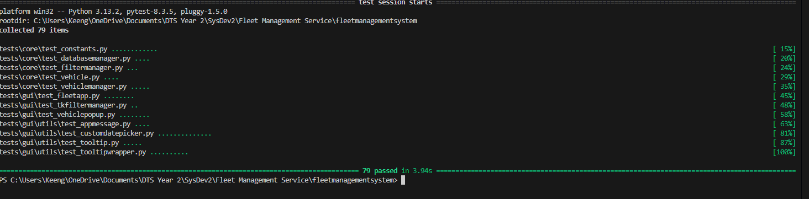

🚗 Fleet Management System

A Fleet Management System for tracking and managing vehicle data. Built with Python, Tkinter, and SQLite, it provides an intuitive UI for adding, editing, and filtering vehicles.

🚀 Features
✅ Add/Edit/Delete Vehicles
✅ Search and Filter Vehicles
✅ Sort by Various Fields
✅ Graphical UI with Tkinter
✅ Custom Date Picker for Vehicle Dates
✅ SQLite Database for Persistent Storage

📜Set Up a Virtual Environment
python -m venv venv
source venv/bin/activate   # On macOS/Linux
venv\Scripts\activate 

📜Install Dependencies
pip install -r requirements.txt

📜Ensure Tkinter is Installed
python -m tkinter

📜Run the Application
python main.py

📝 How to Use
Add a Vehicle → Click "Add Vehicle" and enter details.
Edit a Vehicle → Double-click a row to edit.
Delete Vehicles → Select vehicles and click "Delete Selected".
Search Vehicles → Use the search bar to find vehicles.
Apply Filters → Use filters to refine search results.

📂 Database Structure
The system uses SQLite to store vehicle data.

🔹 Vehicles Table
Column	                    Type	Description
VehicleID	                INTEGER	Primary Key
RegistrationNumber	        TEXT	Unique ID
ManufactureYear	            INTEGER	Year of production
Type	                    TEXT	SUV, Sedan, Truck, etc.
FuelType	                TEXT	Petrol, Diesel, Electric
TaxStatus	                TEXT	Paid/Unpaid
ServiceStatus	            TEXT	Done/Pending
TaxDueDate	                TEXT	YYYY-MM-DD
ServiceDueDate	            TEXT	YYYY-MM-DD

🧪 Testing
This project includes unit tests using pytest.

to run tests
pytest tests/

📜NOTE:
All test work and you might get the error 
"_tkinter.TclError: invalid command name "tcl_findLibrary""
or 
"_tkinter.TclError: Can't find a usable tk.tcl in the following directories:"
this is a tkinter issue and you can run tests individually to see if they work.

📁 Project Structure
fleet-management/
│── core/
│   ├── constants.py  # Stores constats
│   ├── customtypes.py  # Stores custom types
│   ├── databasemanager.py  # Handles database operations
│   ├── filtermanager.py  # Handles filtering operations
│   ├── vehicle.py
│   ├── vehiclemanager.py   # Manages vehicle logic
│── gui/
│   ├── fleetapp.py         # Main application GUI
│   ├── vehiclepopup.py     # Vehicle add/edit popup
│   ├── tkfiltermanager.py  # Manages filter logic
│   ├── utils/
│   │   ├── appmessage.py   # Handles error/info popups
│   │   ├── customdatepicker.py  # Custom date picker widget
│   │   ├── tooltip.py      # Tooltip helper for UI
│   │   ├── tooltipwrapper.py      # Tooltip helper for UI
│── tests/
|   │   core/
|   │   ├── test_constants.py  
|   │   ├── test_databasemanager.py  
|   │   ├── test_filtermanager.py
|   │   ├── test_vehicle.py  
|   │   ├── test_vehiclemanager.py
|   │── gui/
|   │   ├── test_fleetapp.py         
|   │   ├── test_vehiclepopup.py     
|   │   ├── test_tkfiltermanager.py  
|   │   ├── utils/
|   │   │   ├── test_appmessage.py   
|   │   │   ├── test_customdatepicker.py 
|   │   │   ├── test_tooltip.py
│── requirements.txt
│── README.md
│── main.py